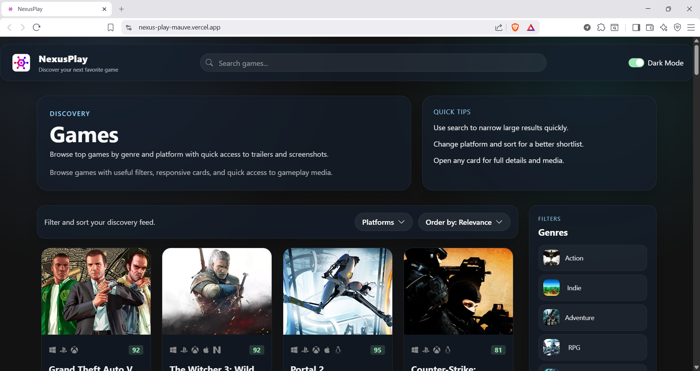
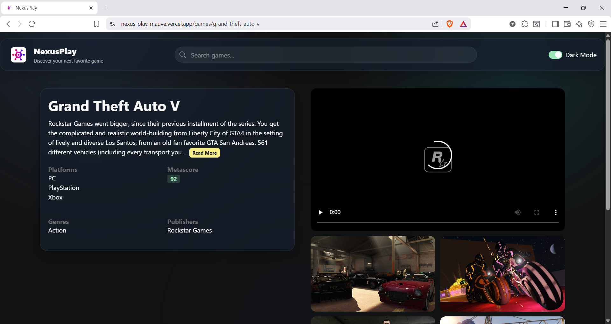

# NexusPlay - GameHub Platform 🎮⚡

NexusPlay is a modern, high-performance **game discovery** web app with a polished UI, robust filtering, and rich game detail pages—built with **React + TypeScript + Vite** and deployed on **Vercel**.

🌐 **Live Demo:** https://nexus-play-mauve.vercel.app

---

## 📸 Screenshots

### 🏠 Home / Discovery

<p align="center">
  
</p>

<br/>

### 🎬 Game Details

<p align="center">
  
</p>

---

## ✨ Features

- 🔎 **Search games** quickly
- 🧩 **Filter & sort** by genre, platform, and more
- ♾️ **Infinite scroll** browsing experience
- 📄 **Game details page** with screenshots, trailer previews, download links, and metadata
- ⭐ **Metascore / critic score** badges
- 🌙 **Dark mode** toggle
- ☁️ **Demo & Live modes**
  - **Demo mode:** works without an API key (limited sample data)
  - **Live mode:** uses the RAWG API (requires API key)

---

## 🧰 Tech Stack

- ⚛️ **React**
- 🟦 **TypeScript**
- ⚡ **Vite**
- 🎨 **Chakra UI**
- 🧪 **Vitest**
- ✅ **ESLint**
- ☁️ **Vercel**
- 🎮 **RAWG API** (Video Games Database)

---

## 🗂️ Project Structure (high-level)

```text
.
├─ backend/             # Express/Vercel API proxy
├─ frontend/            # React + TypeScript + Vite app
├─ vercel.json          # Vercel routing (SPA + /api)
├─ package.json         # Root scripts that delegate to frontend/backend
└─ README.md
```

---

## 🔐 Environment Variables

Create a `.env` file in the project root:

```env
GHUB_API_KEY=your_rawg_api_key    # leave blank for demo mode (if supported)
APP_URL=http://localhost:5173
```

✅ `.env` is ignored by git — **do not commit secrets**.

---

## 🚀 Setup & Development

### ✅ Prerequisites
- Node.js **>= 18**
- npm **>= 9**

### 1) Install dependencies
```bash
npm ci
npm ci --prefix frontend
npm ci --prefix backend
```

### 2) Run locally
```bash
npm run dev
```

This starts both the frontend and backend. If you only need one side:
```bash
npm run dev:frontend
npm run dev:backend
```

Open: http://localhost:5173

---

## 🧪 Quality Checks

```bash
npm run typecheck
npm run lint
npm run test
npm run build
```

---

## ✅ CI (GitHub Actions)

CI runs on pushes/PRs and checks:
- 🔍 Typecheck
- 🧹 Lint
- 🧪 Tests
- 🏗️ Build

---

## ☁️ Deploying to Vercel

1) Import the GitHub repo into Vercel  
2) Set environment variables in Vercel:
- `GHUB_API_KEY`
- `APP_URL` (your deployed URL; used for CORS if your API enforces it)

3) Ensure Vite settings:
- **Build Command:** `npm run build`
- **Output Directory:** `frontend/dist`

4) Verify deep links:
- Open a game detail page and refresh (SPA routing should not 404)

---

## 🐞 Troubleshooting

### `EADDRINUSE: 3030`
Another process is already using port `3030`.

```powershell
netstat -ano | findstr :3030
Stop-Process -Id <PID> -Force
```

### Media not loading
- Hard refresh: `Ctrl + F5`
- Restart dev server(s)
- Confirm API key and CORS config (if running live mode)

---

## 🤝 Contributing

PRs are welcome!  
1) Fork the repo  
2) Create a feature branch  
3) Commit with meaningful messages  
4) Open a pull request  

---

## 📄 License

MIT

---

**NexusPlay - GameHub Platform** © 2026 — Created by Vishant Chaudhary
